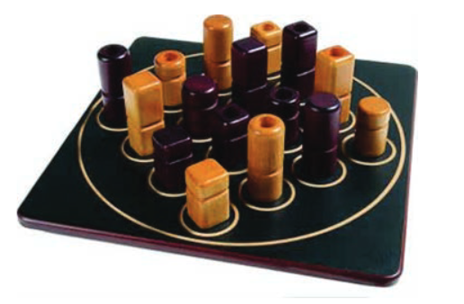

    
   

# Manual Tecnico

 

 > 1. Capa

### 
 Inteligencia Artificial 2020/21

## 
 Jogo do Quatro 

 

 

 <b>Docentes:</b> Joaquim Filipe , Filipe Mariano 

### 
 <b> Realizado por :</b> 

 
João Monteiro 170221039
  
 João Silva 170221099 

 
 

 >2. Arquitetura do sistema

 O projeto está dividido em 3 módulos:

* interact.lisp
* algoritmo.lisp
* jogo.lisp

 O módulo interact contém toda a interação jogador-computador, isto é, encontra-se neste módulo todas as funções da UI (User Interface) do projeto, que permite o jogador visualizar e interagir com o sistema.

 
 O módulo algoritmo contém todas as funções as quais permitem que a implementação do algoritmo funcione sem qualquer problema.

 O módulo jogo contém todas as funções de funcionamento que permitem que seja possível jogar ao jogo do Quatro. 

 

> 3. Algoritmo e sua implementação

## Algoritmo Negamax

O algoritmo Negamax é uma variante do algoritmo minimax baseado na propriedade de soma zero num jogo para dois jogadores.
O Negamax foca-se na função max(a, b) = - min(-a, -b) de forma a simplificar a implementação do algoritmo minimax.
De forma mais clara, o valor de posição do jogador A no jogo será a negação do valor para o jogador B. Desta forma, o aquele que está a jogar procurará uma jogada que maximize a negação do valor resultante da jogada. Esta nova posição deve ter sido analisada pelo jogador oponente. Esta mentalidade funcionará independentemente de qual dos jogadores está a jogar, visto um único procedimento serve para avaliar ambas as jogadas. Esta é uma implementação mais simples do minimaxm, a qual necessita que um jogador selecione uma jogada com sucessor de valor máximo enquanto o oponente seleciona uma de valor mínimo.

O algoritmo Negamax foi implementado da seguinte forma:

O algoritmo contém multiplas funções auxiliares implementadas abaixo da implementação do Negamax.

 >4. Descrição das opções tomadas

Durante a implentação do algoritmo, foi tomada a decisão de utilizar funções auxiliares, visto que devido a complexidade do código, a legibilidade e compreensão do código era limitada.

 >5. Limitações técnicas e ideias para desenvolvimento futuro

* Não foi possivel colocar este algoritmo a funcionar totalmente.

* As jogadas feitas pelo computadores não são, na maioria das vezes, jogadas inteligentes.

