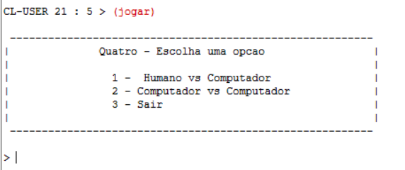
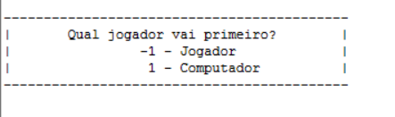
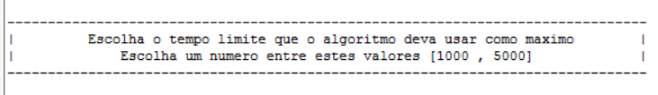
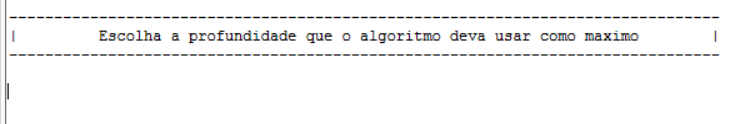
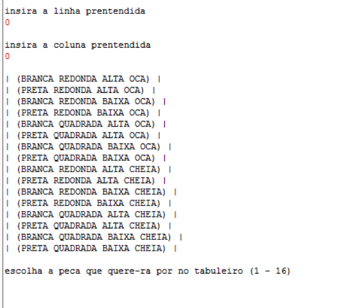
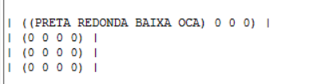

 
    
   

 # Manual de Utilizador 
 

 > 1. Capa

### 
 Inteligencia Artificial 2020/21

## 
 Jogo do Quatro 

 

 

 <b>Docente:</b> Joaquim Filipe , Filipe Mariano 

 ### 
 <b> Realizado por :</b> 

 
João Monteiro 170221039
  
 João Silva 170221099 

 

>2. Introdução

O Jogo do Quatro é constituido por um tabuleiro de dimensão 4 por 4 e um conjunto de 16 peças. Cada peça tem 4 caracteristicas, sendo estas:

* Cor: Branca ou Preta
* Altura: Alta ou Baixa
* Forma: Quadrada ou Redonda
* Enchimento: Cheia ou Oca

O jogo tem como objetivo completar uma linha de 4 peças (horizontal, vertical ou diagonal) de forma a que estas contenham uma caracteristica em comum. 

Apenas existe um movimento possível de realizar neste jogo, o qual se trata da deslocação da peça da reserva para o tabuleiro.

Para completar o jogo, devem ser utilizadas todas as peças da reserva e deve-se aplicar as regras anteriormente insinuadas.

>3. Instalação e utilização

### <u>Para que seja possível utilizar o programa:</u>:

* Comece por abrir e compilar o ficheiro interact.lisp;

* Utilizar o programa LispWorks e, de seguinda, abrir um listener;

* Alterar, nas funçoes path() e path-log(), o caminho do computador do utilizador onde o programa se encontra; 

* Escrever no listener o comando "(jogar)";

* Seguir todos os passos mostrados pela UI (User Interface);

>4. Input/Output e Exemplo

## Ao realizar o comando (jogar) irá surgirá o seguinte:

Neste menu poderá selecionar o modo de jogo, jogador contra computador ou computador contra computador, ou, caso pretenda, sair do programa, selecionados através dos respetivos digitos.

## Após a seleção do modo, surgirá a seguinte série de definições: 

<h4>Primeiro a jogar:</h4>

Neste menu, o utilizador seleciona quem jogará primeiro no jogo que se segue.

Nota: Surge apenas caso tenha selecionado "Jogador vs Computador".

<h4>Tempo limite do algoritmo:</h4>

Quando surge este aviso, o utilizador deverá definir o tempo limite que pretende que o algoritmo esteja em execução, selecionando entre os valores representados, 1000 (1 segundo) e 5000 (5 segundos).

<h4>Profundidade máxima:</h4>

O utilizador deve selecionar a profundidade máxima do algoritmo.

Nota: Tenha em conta que o máximo de profundidade possível no jogo do Quatro é 16.

<h4>Jogue!:</h4>

A definição do algoritmo está completa, logo será possível jogar! O jogador deve inserir a linha e coluna onde quer jogar uma peça, a qual é selecionada através de números entre 1 e 16.

<h4>Tabuleiro de jogo:</h4>

O tabuleiro do jogo é representado da forma anterior. Os zeros representam casas vazias, e as casas ocupadas contêm as caracteristicas da peça que as ocupa.

##Boa sorte!

